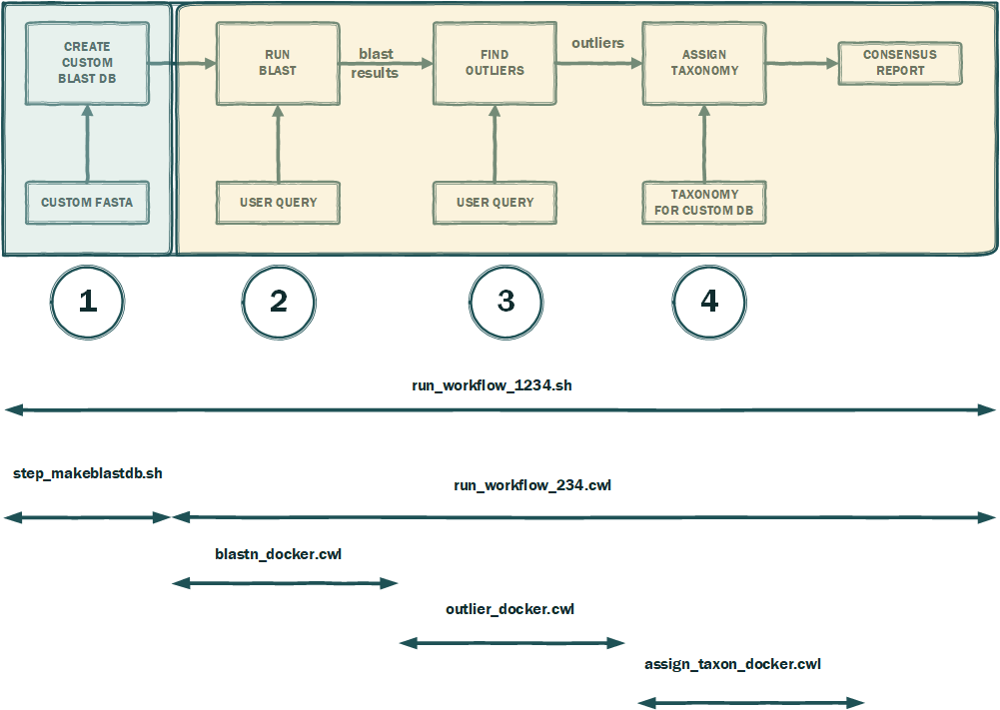

This is an example CWL workflow based on article
"Outlier detection in BLAST hits" by Nidhi Shah , Stephen F. Altschul,  Mihai Pop
PMID: 29588650 PMCID: PMC5863388 DOI: 10.1186/s13015-018-0126-3

It illustrates simplicity usage of  dockerized versions of BLAST tools and python scripts
by the common workflow language (CWL).

Whole workflow is divided into four steps:
1. creation custom BLAST DB 
2. run blast search
3. find outliers
4. assign taxonomy

Due to size and performance consideration first step is deliberately taken from CWL workflow and presented 
as distinguished "step_makeblastdb.sh" shell script. After this step finishes, custom "user_db" will be created 
in "blastdb" subdirectory. 

Absolute location of this "blastdb" directory will be written to the run_workflow_234_input.yml file substituting 
PATH-TO-BLASTDB  placeholder.

In case of different user requirements,  creation of BLASTD database and modification of the run_workflow_234_input.yml
needs to be done accordingly.

The rest of steps (2-3-4)  are combined into one CWL run_workflow_234.cwl  with corresponding input.

System requirements to run example workflow:
Python/Python3 interpreter and virtualenv package are available and python is python3 version >= 3.6
Docker installed and user assigned to the docker group

How to run:
1. git clone --recurse-submodules    https://github.com/ncbi/cwl-demos.git
2. cd cwl-demos/outlier-hit-detection-pipeline 
3. ./run_workflow_1234.sh
4. final results are in  consensus_taxonomy.txt file

At first run will trigger download of two Docker images which may take some time.

At the end of execution in current directory will be created "consensus_taxonomy.txt" report

Please check script itself for separate steps and article for more detailed explanation of outlier detection algorithm

Thank you

BLAST group 
